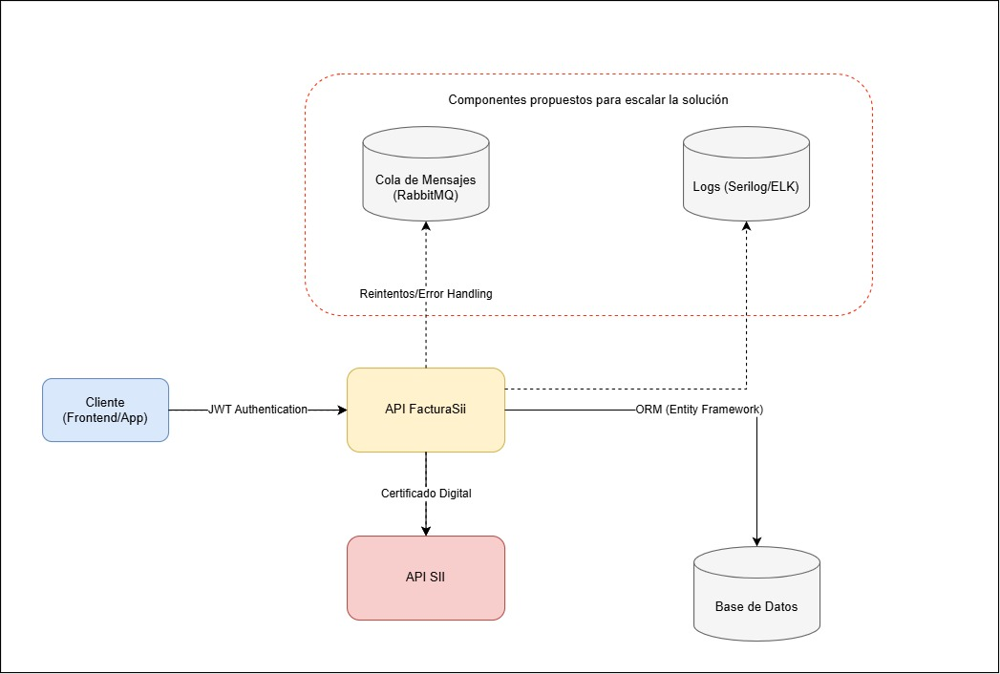
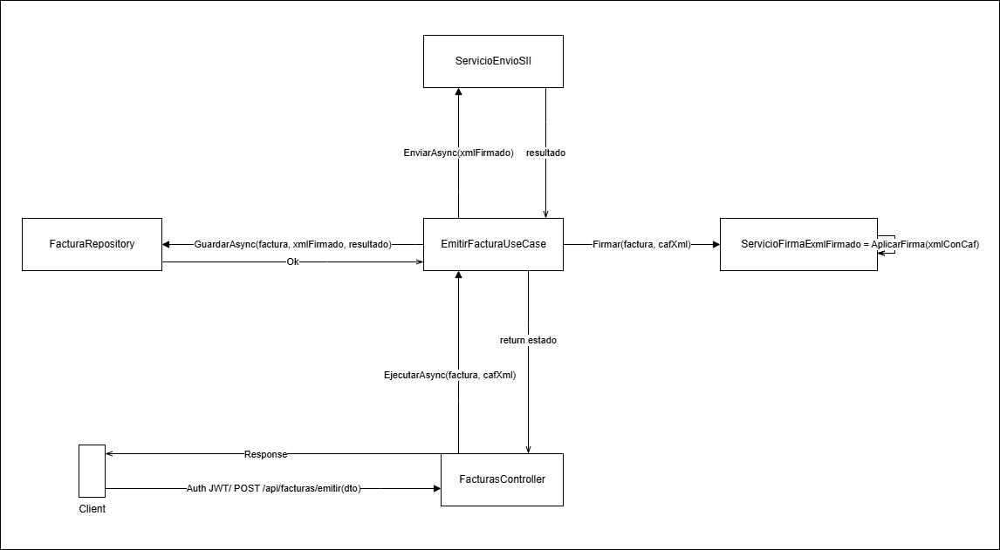
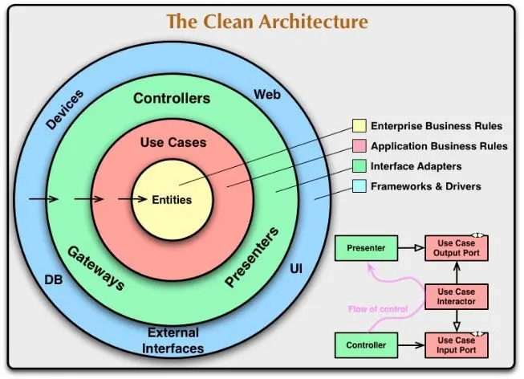

# prueba_tecnica_iconstruye

Construir y subir imágenes, se debe estar en la carpeta del docker-compose: docker-compose up --build -d

Bajar docker-compose: docker-compose down

## Diseño de soluciones: presentar diagramas de arquitectura clara y moderna.

Arquitectura propuesta:

Los principales componentes del proyectos se pueden graficar con el siguiente flujo:

Imagen referencial sobre la arquitectura que se adoptó en el proyecto:

## Decisiones técnicas
El proyecto se estructura tomando el patrón de diseño DDD y arquitecturas limpias, se respeta buenas prácticas de SOLID para la codificación. La arquitectura adoptada nos permite lo siguiente:
Permite escalar componentes de forma independiente.

Aísla fallas y facilita la evolución de funcionalidades específicas.

Mejora la mantenibilidad a largo plazo.

Permite el desarrollo concurrente entre equipos.
Como se separan las capas y se utilizan interfaces, facilitará a los test unitarios y cambios en lógica futura.

El desarrollo se realiza en .net 8 por un lenguaje multipropósito y que está dentro de los lenguajes solicitados en el desafío.
PostgreSQL es robusto, confiable, y con excelente soporte para integridad y consultas complejas
Docker asegura portabilidad, reproducibilidad de entornos, y facilita CI/CD.

## Visión de producto: entender cómo lo técnico conecta con el valor
para el usuario.

Este producto da beneficios a las áreas de negocio en optimizar tiempos de carga de facturas en el SII ya que las personas no tendrán que subir las facturas de forma manual que es lento y propensa a problemas humanos. Con el diseño adoptado se podrá integrar con distintos sistemas de la empresa y automatizar procesos y validar el envío de los informes.

La aplicación está desarrollada para poder escalar ante nuevos requerimientos, integrar logs y métricas de rendimiento, así como el fácil despliegue y restauración ante fallas.

